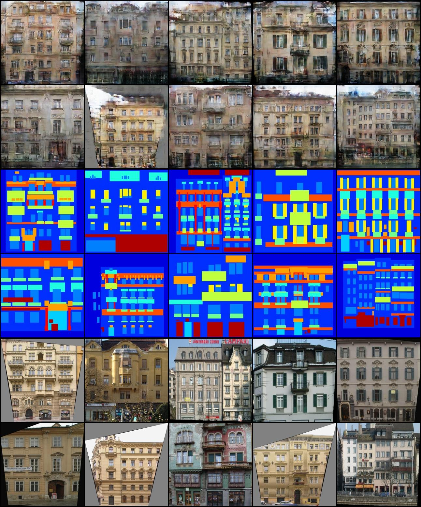

Pix2Pix
======================

:star: Star this project on GitHub — it helps!

[Pix2Pix](https://arxiv.org/abs/1609.04802) is an example of `image-to-image` translation GAN.

### Install
```
git clone https://github.com/akanametov/pix2pix
cd ./pix2pix
```

### Usage
#### Datasets
This project allows to train Pix2Pix GAN on three datasets:
- **Cityscapes**
- **Facades**
- and **Maps**
,so that each of them is going to downloaded automatically by following:
```python
from dataset import Cityscapes, Facades, Maps

dataset = Facades(root='.',
                  transform=None, # if transform is None, then it returns PIL.Image
                  download=True,
                  mode='train',
                  direction='B2A')
```
#### Transforms
For simple conversion of imageA and imageB from `PIL.Image` to `torch.Tensor` use `dataset.transforms`:
```python
from dataset import transforms as T
# it works almost like `torchvision.transforms`
transforms = T.Compose([T.Resize(size=(..., ...)), # (width, height)
                        T.CenterCrop(size=(..., ...), p=...), # (width, height); probability of crop/else resize
                        T.Rotate(p=...), # probability of rotation on 90'
                        T.HorizontalFlip(p=...), # probability of horizontal flip
                        T.VerticalFlip(p=...), # probability of vertical flip
                        T.ToTensor(), # to convert PIL.Image to torch.Tensor
                        T.Normalize(mean=[..., ..., ...],
                                     std=[..., ..., ...])])
```
As input, `transforms` take one/or two arguments (`imageA`/or `imageA` and `imageB`):
```python
imgA_transformed = transforms(imgA)
# or
imgA_transformed, imgB_transformed = transforms(imgA, imgB)
```
There are also other `transforms`:
```python
T.ToImage() # to convert torch.Tensor to PIL.Image 
T.DeNormalize(mean=[..., ..., ...],
               std=[..., ..., ...])])
```

#### Training

To train Pix2Pix on one of available datasets use `train.py`:
```
./pix2pix python train.py [--epochs EPOCHS] [--dataset DATASET] [--batch_size BATCH_SIZE] [--lr LR]

Train Pix2Pix

optional arguments:
  -h, --help            show this help message and exit
  --epochs EPOCHS       Number of epochs
  --dataset DATASET     Name of the dataset: ['facades', 'maps', 'cityscapes']
  --batch_size BATCH_SIZE
                        Size of the batches
  --lr LR               Adams learning rate
```

#### Results
**Facades:**

<a></a>

**Maps**

<a></a>

## License

This project is licensed under MIT.

## Links

* [Image-to-Image Translation with Conditional Adversarial Networks (arXiv)](https://arxiv.org/pdf/1611.07004.pdf)
