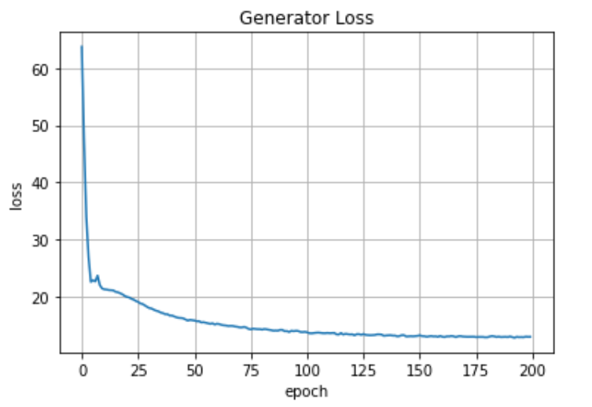
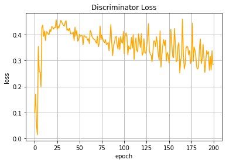

Pix2Pix
======================

:star: Star this project on GitHub — it helps!

[Super-Resolution GAN](https://arxiv.org/abs/1609.04802) is one of the best examples in GAN's application. It allows
to imporove the quality of input low-resolution image. As **Generator** this GAN uses
**SRResNet** (Super-Resolution Residual Network). In order to provide better quality of
the output image the network is trained on three different loss functions.

## Table of content

- [Evaluation](#eval)
- [Training](#train)
    - [Database](#database)
    - [WarmUp of Generator](#warmup)
    - [Training with Discriminator](#train)
- [License](#license)
- [Links](#links)

## Evaluation

You can evaluate pretrained **Super-Resolution GAN** on your images.
To do this use `eval.py`.

## Training

### Database

The Super-Resolution GAN was trained on **STL10** dataset from `torchvision.dataset`.

### WarmUp of Generator

Before to train both **Generator** and **Discriminator** we should pretrain our **Ganarator** on
dataset with **Pixel-wise Loss** function.

See [Super-Resolution [GAN WarmUp]](https://github.com/akanametov/SuperResolution/blob/main/demo/SuperResolution%5BGeneratorWarmUp%5D.ipynb) for **Generator**'s warmup.

### Training with Discriminator

After **Generator** warmup we train booth **Generator** and **Discriminator** with their loss functions.
The **Generator loss** consists of **Adverserial loss**(BCE loss between *fake prediction and target*),
**Model Based loss**(feature based MSE loss between *fake and real images*) and **Pixel-wise loss**(MSE loss between *fake and real images*).

**After 100 epochs of training:**

See [Super-Resolution](https://github.com/akanametov/SuperResolution/blob/main/demo/SuperResolution.ipynb) for **SR-GAN**'s training.

## License

This project is licensed under MIT.

## Links

* [Super-Resolution GAN (arXiv article)](https://arxiv.org/abs/1609.04802)
